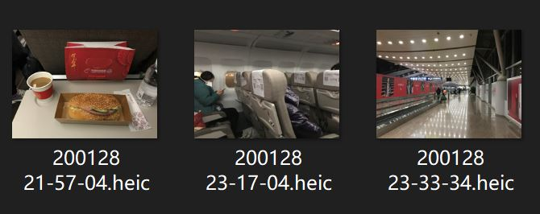

# photoRename

## What's this
A lightweight Python script that batch‑renames photos based on their EXIF timestamps.  
Useful for organizing photos taken on iPhone or other cameras.

The script reads EXIF metadata directly in Python (no exiftool required) and renames files into:

```
YYMMDD HH-MM-SS.ext
```

If a filename already exists, the script automatically appends `(2)`, `(3)`… to avoid conflicts.

---

## Features
- Read EXIF `DateTimeOriginal`
- Fallback to file modify time or creation time
- Preview all rename results before applying
- Auto‑resolve filename conflicts
- Supports JPG / PNG / MOV  
  (HEIC requires additional library support)

---

## How to use
0. Install requirements:
   ```
   pip install requirements.txt
   ```

1. Run the script:
   ```
   python pRename.py
   ```
2. Input:
   - Folder path  
   - File extension (e.g., `.jpg`, `.png`, `.mov`)
   - Rename rule:
     - `1` — Date/Time Original  
     - `2` — File Modify Date  
     - `3` — Creation Date (useful for MOV files)

3. Confirm the preview and proceed with renaming.

---

## Screenshot

